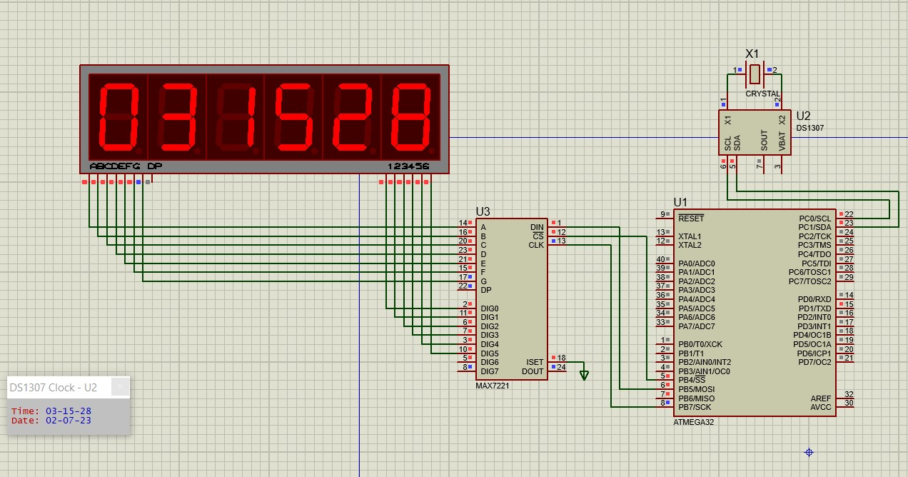

# Digital Clock with ATmega32

Digital Clock with Atmega32 microcontroller. I interfaced with DS1307 RTC module for real-time retrieval and MAX7221 module for 7-segment digits driver display.
Used I2C communication protocol to interface with the DS1307, and used SPI communication protocol to control and send digits to the 7-segment digits driver display.

## Usage & Installation
1. Install the avr tool chain according to your OS from [here](https://www.microchip.com/en-us/tools-resources/develop/microchip-studio/gcc-compilers)
2. Make sure you set up the compiler path according to your IDE
3. Install make if you don't have it already from [here](https://gnuwin32.sourceforge.net/packages/make.htm)
4. type ```make build``` for building the entire project
5. type ```make all``` for building the entire project and uploading it on the Atmega32

## Connections


## Demo

